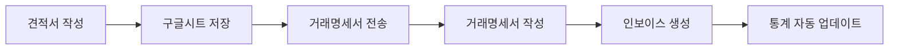

# 🎯 IBS Analytics 시스템 설정 및 사용 가이드

## 📋 **개요**

IBS Analytics 시스템은 견적서, 인보이스, 거래명세서를 통합 관리하고 실시간 비즈니스 통계를 제공하는 스마트 솔루션입니다.

### ✨ **주요 기능**
- 📊 **실시간 Analytics Widget**: 각 HTML 문서에 통계 위젯 표시
- 📈 **자동 통계 대시보드**: 구글시트에서 종합 통계 관리
- 🔄 **데이터 연동**: 견적서 → 거래명세서 → 인보이스 자동 연결
- ⚡ **자동화**: 매일 통계 업데이트 및 알림 기능

---

## 🚀 **1단계: 구글 Apps Script 설정**

### **1.1 Apps Script 프로젝트 생성**

1. **구글시트 열기**: https://docs.google.com/spreadsheets/d/1MUHiU8a0p1aBs0wU94gmmlugwmB9qSYO8NLl-qZ9-ho/edit
2. **확장 프로그램** → **Apps Script** 클릭
3. 기존 코드 삭제 후 `google_apps_script_enhanced.js` 내용 복사 붙여넣기

### **1.2 웹앱 배포**

```javascript
// 1. 저장 (Ctrl+S)
// 2. 배포 → 새 배포
// 3. 유형: 웹앱
// 4. 실행 계정: 나
// 5. 액세스 권한: 모든 사용자
// 6. 배포 클릭
```

### **1.3 권한 승인**

- **승인 검토** → **고급** → **프로젝트로 이동** → **허용**
- 배포된 웹앱 URL 복사 (Analytics Widget에서 사용)

---

## 🔧 **2단계: HTML 파일 업데이트**

### **2.1 Analytics Widget 확인**

모든 HTML 파일에 Analytics Widget이 추가되었습니다:

- ✅ `ibs_quotation_improved.html` - 견적서 통계
- ✅ `interactive_delivery_statement.html` - 거래명세서 통계  
- ✅ `professional_invoice_a4_optimized.html` - 인보이스 통계

### **2.2 Widget 기능**

```javascript
// 📊 실시간 통계 표시
- 오늘 문서 수
- 이번 달 금액
- 평균 금액
- 성사율/결제율/배송율

// 📈 주간 트렌드 차트
- Chart.js 기반 라인 차트
- 최근 7일 데이터

// 🔔 실시간 알림
- 유효기간 임박 알림
- 목표 달성률 알림
- 배송 예정 알림
```

---

## 📊 **3단계: 통계 대시보드 활용**

### **3.1 자동 업데이트**

```javascript
// Apps Script에서 실행
function runAllUpdates() {
  updateStatsDashboard();  // 통계 대시보드 업데이트
  createTriggers();        // 자동화 트리거 설정
}
```

### **3.2 수동 통계 확인**

```javascript
// 개별 통계 테스트
function testAnalyticsAPI() {
  const quotationStats = getAnalyticsStats('quotation');
  const invoiceStats = getAnalyticsStats('invoice');
  const transactionStats = getAnalyticsStats('transaction');
}
```

---

## 🎮 **4단계: 사용 방법**

### **4.1 견적서 작성 → 거래명세서 → 인보이스 플로우**



### **4.2 Analytics Widget 사용법**

1. **위젯 토글**: 헤더 클릭으로 접기/펼치기
2. **새로고침**: 🔄 버튼으로 최신 데이터 로드
3. **자동 업데이트**: 5분마다 자동 새로고침
4. **인쇄 시 숨김**: 프린트할 때 자동으로 숨겨짐

---

## 🔍 **5단계: 문제 해결**

### **5.1 Analytics Widget이 안 보일 때**

```javascript
// 브라우저 콘솔에서 확인
console.log('Analytics Widget 상태:', document.getElementById('analyticsWidget'));

// 수동으로 통계 업데이트
refreshAnalytics();
```

### **5.2 구글시트 연동 오류**

```javascript
// Apps Script 로그 확인
console.log('📊 통계 데이터 요청:', type);

// 수동으로 통계 대시보드 업데이트
updateStatsDashboard();
```

### **5.3 CORS 오류 해결**

```javascript
// Apps Script doGet 함수에서 CORS 헤더 설정됨
.setHeaders({
  'Access-Control-Allow-Origin': '*',
  'Access-Control-Allow-Methods': 'GET, POST, OPTIONS',
  'Access-Control-Allow-Headers': 'Content-Type'
});
```

---

## 📈 **6단계: 고급 기능**

### **6.1 커스텀 알림 설정**

```javascript
// 월 목표 금액 변경 (기본: 1천만원)
const monthlyTarget = 15000000; // 1천5백만원으로 변경

// 유효기간 알림 기간 변경 (기본: 3일)
return daysUntilExpiry <= 7 && daysUntilExpiry >= 0; // 7일로 변경
```

### **6.2 차트 커스터마이징**

```javascript
// 차트 색상 변경
borderColor: '#ff6b6b',           // 빨간색
backgroundColor: 'rgba(255, 107, 107, 0.1)',

// 차트 타입 변경
type: 'bar',  // 막대 차트
type: 'pie',  // 파이 차트
```

### **6.3 이메일 알림 활성화**

```javascript
// Apps Script에서 이메일 알림 설정
MailApp.sendEmail(
  'your-email@example.com',
  '견적서 유효기간 알림',
  message
);
```

---

## 🎯 **7단계: 성능 최적화**

### **7.1 데이터 캐싱**

```javascript
// 로컬 스토리지 활용
localStorage.setItem('analyticsCache', JSON.stringify(data));
const cachedData = JSON.parse(localStorage.getItem('analyticsCache'));
```

### **7.2 API 호출 최적화**

```javascript
// 중복 호출 방지
let isLoading = false;
if (!isLoading) {
  isLoading = true;
  await fetchAnalyticsData();
  isLoading = false;
}
```

---

## 🔧 **8단계: 유지보수**

### **8.1 정기 점검 항목**

- [ ] 구글시트 데이터 정합성 확인
- [ ] Analytics Widget 정상 작동 확인
- [ ] Apps Script 실행 로그 점검
- [ ] 트리거 작동 상태 확인

### **8.2 백업 및 복구**

```javascript
// 구글시트 백업
function backupData() {
  const backup = SpreadsheetApp.create('IBS_Backup_' + new Date().toISOString());
  // 데이터 복사 로직
}
```

---

## 📞 **지원 및 문의**

### **기술 지원**
- 📧 이메일: support@ibs-solution.com
- 📱 전화: 010-3664-6268
- 🌐 웹사이트: https://ibs-solution.com

### **업데이트 정보**
- 📅 정기 업데이트: 매월 첫째 주
- 🔔 긴급 패치: 필요시 즉시 배포
- 📋 변경사항: GitHub 릴리즈 노트 확인

---

## 🎉 **완료!**

이제 IBS Analytics 시스템이 완전히 설정되었습니다!

### **다음 단계:**
1. 🧪 테스트 데이터로 시스템 검증
2. 📊 실제 업무에 적용
3. 📈 성과 모니터링 및 개선
4. 🚀 추가 기능 요청 및 개발

**Happy Analytics! 📊✨** 